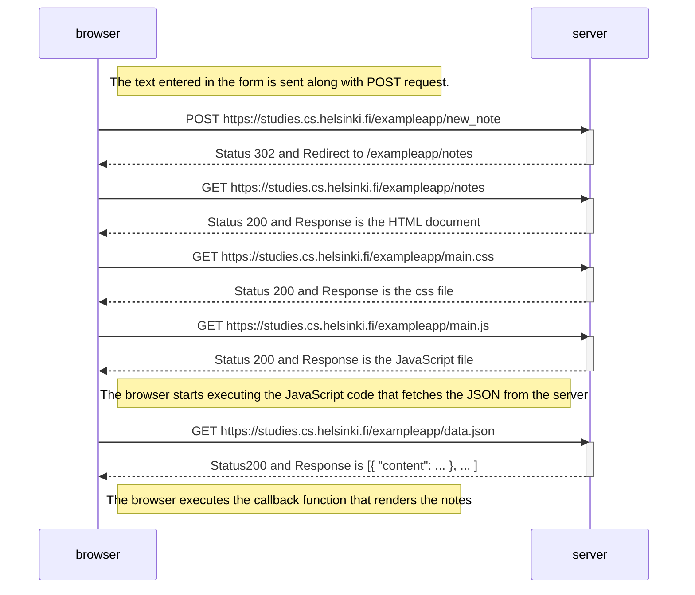

# Sequence diagram for New note (AJAX)

```mermaid

sequenceDiagram
    participant browser
    participant server 


    Note right of browser: The text entered in the form is sent along with POST request.
    browser->>server: POST https://studies.cs.helsinki.fi/exampleapp/new_note
    activate server
    server-->>browser: Status 302 and Redirect to /exampleapp/notes
    deactivate server


    browser->>server: GET https://studies.cs.helsinki.fi/exampleapp/notes
    activate server
    server-->>browser: Status 200 and Response is the HTML document
    deactivate server

    browser->>server: GET https://studies.cs.helsinki.fi/exampleapp/main.css
    activate server
    server-->>browser: Status 200 and Response is the css file
    deactivate server

    browser->>server: GET https://studies.cs.helsinki.fi/exampleapp/main.js
    activate server
    server-->>browser: Status 200 and Response is  the JavaScript file
    deactivate server

    Note right of browser: The browser starts executing the JavaScript code that fetches the JSON from the server

    browser->>server: GET https://studies.cs.helsinki.fi/exampleapp/data.json
    activate server
    server-->>browser: Status200 and Response is [{ "content": ... }, ... ]
    deactivate server

    Note right of browser: The browser executes the callback function that renders the notes
```
