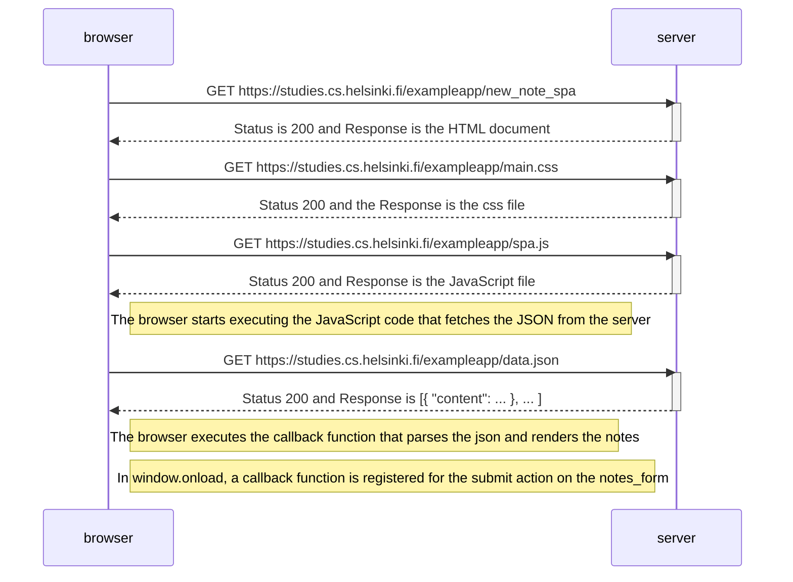

# Sequence diagram for single page app

```mermaid

sequenceDiagram
    participant browser
    participant server 


    browser->>server: GET https://studies.cs.helsinki.fi/exampleapp/new_note_spa
    activate server
    server-->>browser: Status is 200 and Response is the HTML document
    deactivate server

    browser->>server: GET https://studies.cs.helsinki.fi/exampleapp/main.css
    activate server
    server-->>browser: Status 200 and the Response is the css file
    deactivate server

    browser->>server: GET https://studies.cs.helsinki.fi/exampleapp/spa.js
    activate server
    server-->>browser: Status 200 and Response is the JavaScript file
    deactivate server

    Note right of browser: The browser starts executing the JavaScript code that fetches the JSON from the server

    browser->>server: GET https://studies.cs.helsinki.fi/exampleapp/data.json
    activate server
    server-->>browser: Status 200 and Response is [{ "content": ... }, ... ]
    deactivate server

    Note right of browser: The browser executes the callback function that parses the json and renders the notes
    Note right of browser: In window.onload, a callback function is registered for the submit action on the notes_form
```
