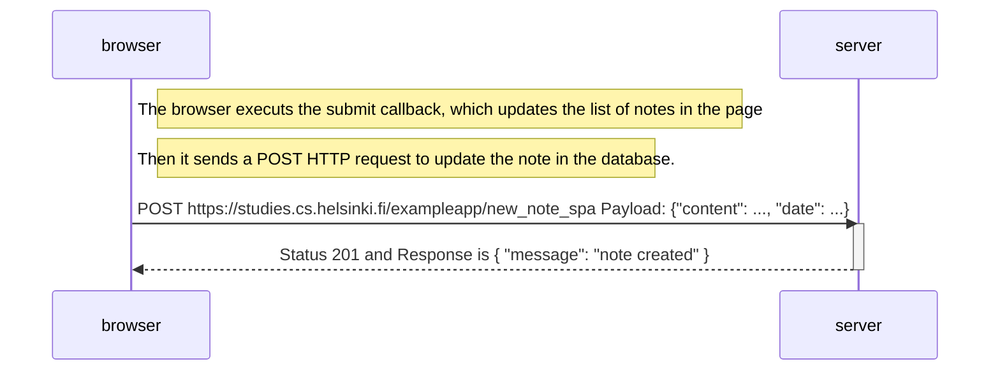

# Sequence diagram for new note (Single page app)

```mermaid

sequenceDiagram
    participant browser
    participant server 


    Note right of browser: The browser executs the submit callback, which updates the list of notes in the page
    Note right of browser: Then it sends a POST HTTP request to update the note in the database. 

    browser->>server: POST https://studies.cs.helsinki.fi/exampleapp/new_note_spa Payload: {"content": ..., "date": ...}
    activate server
    server-->>browser: Status 201 and Response is { "message": "note created" }
    deactivate server


```
